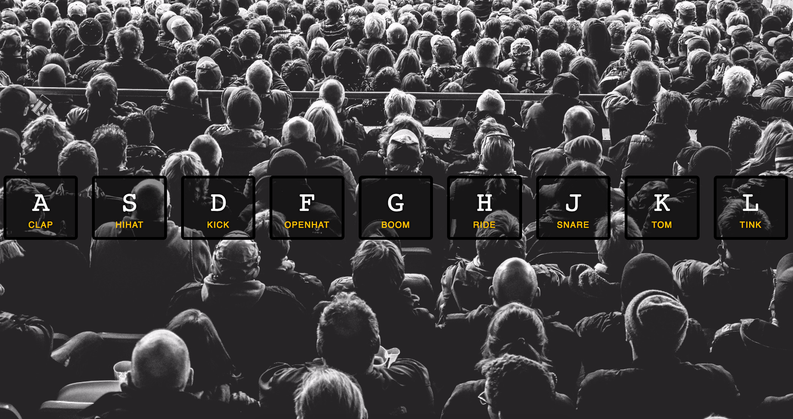

# 01 - Drum Kit

**Challenge:** When you press a key on your keyboard it plays the corresponding key sound and it also animates the key pressed(button on the screen) by scaling it and adding a border around it.

**Things to Learn:** Key Events, playing audio, listening for the transitionend event

**Demo** [here](https://tjgillweb.github.io/JavaScript30/01%20-%20JavaScript%20Drum%20Kit/).



So, lets begin!

When you keyup or keydown, there is a an associated keycode associated with that key. There is a tool where we can check the associated keycode for the corresponding key. You can find it [here](http://keycode.info/).

First, we need to listen for the keyup event

```
window.addEventListener('keydown', function (e) {
    const audio = document.querySelector(`audio[data-key = "${e.keyCode}"]`);  //use of template string
```    
stop the function from running altogether so that if we press some other key on the keyboard no audio is played.
    ```
    if (!audio) return;
    ```
    
if you call .play on an audio element that is already playing, it won't play it again. So wee need to rewind it to the start of the     audio element so that if you hit it in succession over and over again, it will just rewind it to the start.   
    ```
    audio.currentTime = 0; //rewind to the start
    audio.play();
    ```

Now we want to select the corresponding key to the audio element because we want to add animation to the button
```
const key = document.querySelector(`.key[data-key = "${e.keyCode}"]`);
    key.classList.add('playing'); //adds the border and scales up the key
```
To remove the class 'playing' from the key, we use a `transitionend` event that will fire when the thing has stopped animating itself on in.
What is transitionend event? I didn't get clicked but I was transitioned, I transitioned myself from scale: 1 border:black to scale:1.1 border:yellow. We can listen on each key for when the transitionend event happens.

Now we need to select every single key on the page, because we need to listen for the transitionend event on each one.
```
const keys = document.querySelectorAll('.key');
      function removeTransition(e) {
        if (e.propertyName !== 'transform') return; //skip it if its not a transform
        this.classList.remove('playing'); //this is the key on which we have the eventListener
      }
      //Listen for transitionend event
      keys.forEach(key => key.addEventListener('transitionend', removeTransition));
});
```
