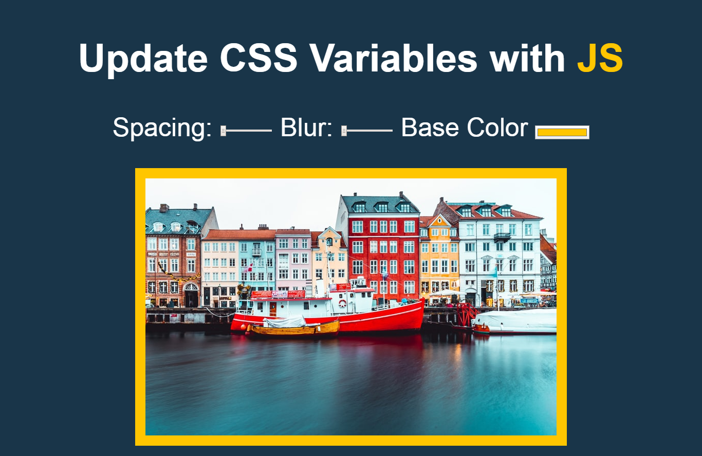

# 03 - CSS Variables

**Challenge:** Manipulate the padding, blur amount, and background color of the image by using JavaScript to update the CSS variables.

**Things To Learn:** CSS Variables, NodeList, dataset property, change and mousemove events. 

**Demo:**[here](https://tjgillweb.github.io/JavaScript30/03%20-%20CSS%20Variables/).



So, lets begin!

CSS variables can be updated with JavaScript, meaning that when you update a variable in CSS, everywhere on the page that that variable is referenced will update itself.
It is different from **SASS** variables in that you define the SASS variables at compile time and then it gets compiled and you cannot change it.

- we use base color to define the background of the image and also the highlight color of 'JS' in the heading.
```
<h2>Update CSS Variables with <span class='hl'>JS</span></h2>
```

### In CSS

- First we define our CSS variables.
To make CSS variables work, we need to declare the CSS variables on some sort of element.
In our case, we're going to declare it on the root which is the highest level and it will hold the default values.
```
:root{
      --base: #ffc600;
      --spacing: 20px;
      --blur: 10px;
    }
```

- Now we use the CSS variables
```
img {
      padding: var(--spacing);
      background: var(--base);
      filter: blur(var(--blur));
    }

.hl{
      color: var(--base);
   }
```

### In JavaScript

Now, we need to update these CSS variables using JavaScript.
- First thing that we need to do is we need to select all three of the inputs(with input id of spacing, blur, and base) so that when they change, we can then update the CSS variables.
```
const inputs = document.querySelectorAll('.controls input');
```
- In JS, `querySelectorAll` gives you a `NodeList` (not an Array).
The difference between a NodeList and an array is that an array has all kinds of methods like map and reduce, but NodeList has a limited set of methods.
You can open the proto in dev tool and see its methods.

- To loop over the inputs, we will use the `forEach` method which just recently got added to NodeList. So, we don't need to convert it into an array.
- Now , we will create the `handleUpdate` function and then we'll listen for a change event on each of the inputs.
We will also add the mousemove event so that when we move the value, it's also going to trigger a change.
```
function handleUpdate(){
  console.log(this.value)
}
inputs.forEach(input => input.addEventListener('change', handleUpdate));
inputs.forEach(input => input.addEventListener('mousemove', handleUpdate));
```

- Now lets work on getting the values out of the handleUpdate function.
So the first thing we need to know is what is the suffix of the value that we're working on. Because the spacing and blur values have a suffix 'px'.

#### Handling suffix with dataset
We use dataset to deal with suffix px by adding data-sizing: px as an attribute on input element.

`<input type="range" name="blur" min="0" max="25" value="10" data-sizing="px">`
and the get the suffix by `dataset.sizing` via JS

`const suffix = this.dataset.sizing || '';`
and don't forget a condition with || '' for <input type=color> which has no px.

#### Update the CSS Variables
We will select our entire document which is our root here and we will set a property of base, spacing, or blur
```
function handleUpdate() {
  const suffix = this.dataset.sizing || '';
  document.documentElement.style.setProperty(`--${this.name}`, this.value + suffix);
}
```


    


