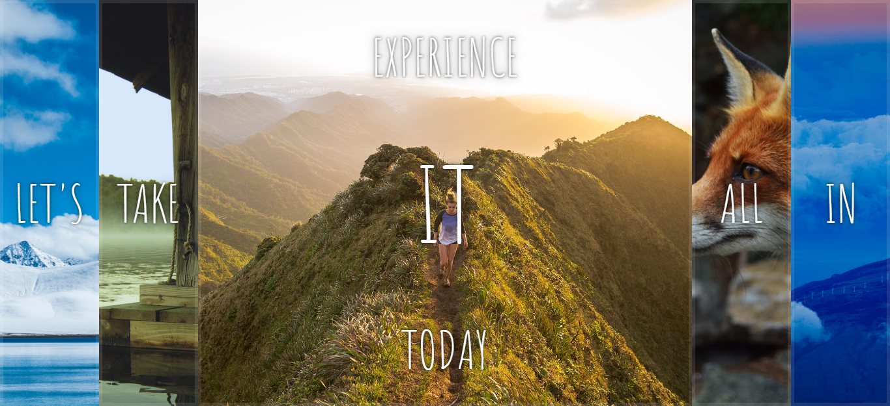

# 05 - Flex Panel Gallery

**Challenge:** Given a div with a class of `panels`, and inside each of these panels is going to be a div called `panel`. And then inside of each of those panels is going to be 3 words like "Give," "Take," "Receive." 
Write appropriate CSS and Javascript so that the div `panel` when clicked, makes the words grow in size, as well as they're going to fall from the top and come up from the bottom.

**Things To Learn:** CSS Flexbox, JS toggle() method, transitionend,

**Demo:**[here](https://tjgillweb.github.io/JavaScript30/05%20-%20Flex%20Panel%20Gallery/).



So, lets begin!

### In CSS

- ```CSS
  .panels {
    display: flex; // make a flex-container
  }
  ```
  
- ```CSS
  .panel {
     flex: 1; // to evenly distribute space among all flex children
     display: flex;  // make it a flex-container (it's both a flex-item and a flex-container)
     flex-direction: column;
     justify-content: center;
     align-items: center;
  }
  ```
  
- ```CSS
  .panel > * {
     flex: 1 0 auto; 
     display: flex;  
     justify-content: center;
     align-items: center;
  }
  ```
 
- Hide the first-child all the way up and last-childs all the way down.
```CSS
 .panel>*:first-child {
    transform: translateY(-100%);
  }

  .panel.open-active>*:first-child {
    transform: translateY(0);
  }

  .panel>*:last-child {
    transform: translateY(100%);
  }

  .panel.open-active>*:last-child {
    transform: translateY(0);
  }
```

- When the `panel` has a class of open, it's going to take 5 times the space as the other flex items and also increase the font size.
```CSS
.panel.open {
  flex: 5;
  font-size: 40px;
}
```
  
### In Javascript
  
- Add click event to toggle the 'open' class on each `panel` using JS `toggle()` function.
```Javascript
const panels = document.querySelectorAll('.panel');

function toggleOpen(){
    this.classList.toggle('open');
}

panels.forEach(panel => panel.addEventListener('click', toggleOpen));
```
***Note:*** If we use toggleOpen() inside addEventListener, then it would run on page load. But we don't want to run the function. We just want to give it reference to the function and say, Hey, when someone clicks me, make sure that you go find this function and run.

- Once the center word has finished transitioning itself open, we want to bring in the word from the top and bring in the word from the bottom.

```Javascript
function toggleActive(e){
    if(e.propertyName.includes('flex')){
        this.classList.toggle('open-active');
    }
}
panels.forEach(panel => panel.addEventListener('transitionend', toggleActive));
```
***Note:*** We didn't use (e.propertyName == 'flex-grow') because some browsers use 'flex-grow' and some only 'flex'. So, to cover both the cases we used the  `includes` property.

***To summarize:*** What we did is that first we listen for a click on each panel. When someone clicks, it opens it. That's going to then, in turn, trigger a CSS open and when that finishes, `transitionend` will fire, and that will toggle open-active.
