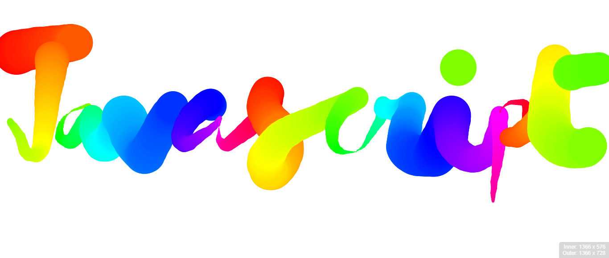

# 08 - Fun with HTML5 Canvas

**Challenge:** Create a canvas element in which the user should be able to click and drag their mouse to draw.

**Things To Learn:** Fundamentals of HTML5 Canvas Element, HSL, mouse events.

**Demo:**[here](https://tjgillweb.github.io/JavaScript30/08%20-%20Fun%20with%20HTML5%20Canvas/).



So, lets begin!

### The `<canvas>` element

- #### In HTML
    ```HTML
    <canvas id="draw" width="800" height="800"></canvas>
    ```
  - The `<canvas>` element has only two attributes, width and height. These are both optional and can also be set using DOM properties.
  - When no width and height attributes are specified, the canvas will initially be **300** pixels wide and **150** pixels high.

- #### In Javascript
  - The canvas is initially blank. To display something, a script first needs to access the rendering context and draw on it. 
  - The `<canvas>` element has a method called `getContext()`, used to obtain the rendering context and its drawing functions. 
  - `getContext()` takes one parameter, the type of context.
  
```Javascript
    const canvas = document.querySelector('#draw');
    const ctx = canvas.getContext('2d');
```
